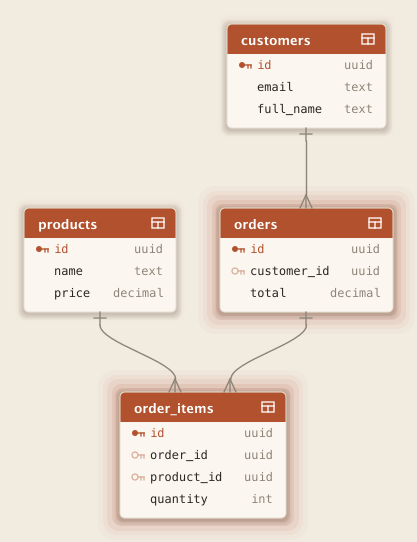
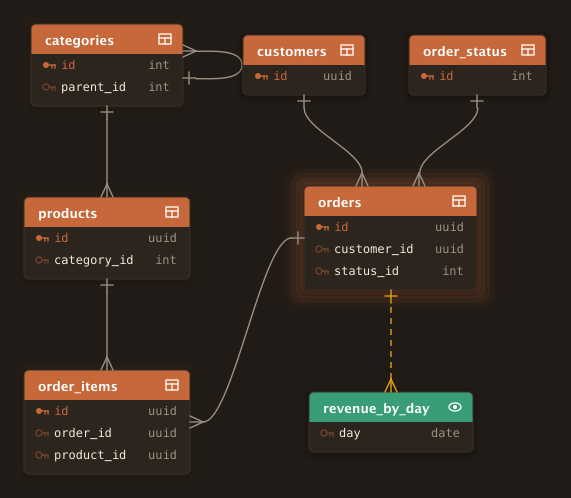
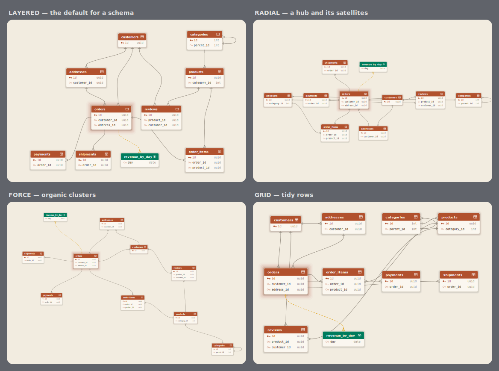
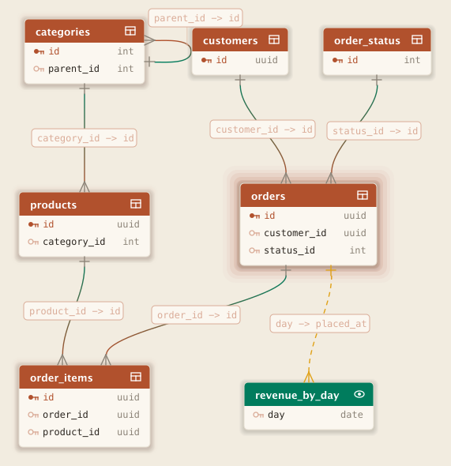
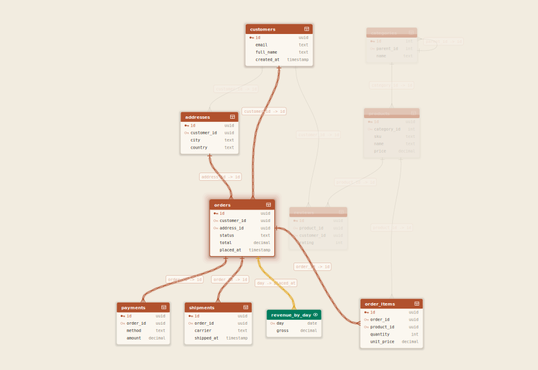
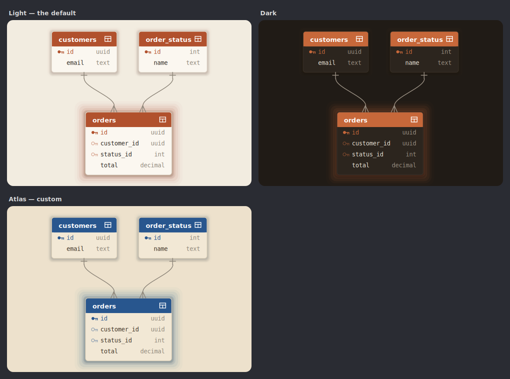

<p align="center">
  <picture>
    <source media="(prefers-color-scheme: dark)" srcset="docs/logo-dark.svg">
    
  </picture>
</p>

<p align="center">
Opinionated relationship maps for Swing. Pure JDK — zero dependencies — with a fluent one-line schema<br>
builder, polished interactive diagrams by default (click-spotlight, live search, community-clustered<br>
layout), easy theming, a compact native format, and PNG / SVG / interactive-HTML export.
</p>

<p align="center">
  
</p>

<sup>A simulated session: the camera settles on a table and clicks it, spotlighting its neighbourhood — the
rest dims to a ghost, its relationships light up and flow — then moves on to the next. Exactly what the live
view does under your cursor.</sup>

## Quickstart

Describe entities, fields, and the references between them; Mappa lays them out and draws them.

```java
import io.github.wesleym.mappa.Mappa;

var map = Mappa.schema("Store")
        .table("customers", t -> t
                .primaryKey("id", "uuid")
                .column("email", "text")
                .column("full_name", "text"))
        .table("products", t -> t
                .primaryKey("id", "uuid")
                .column("name", "text")
                .column("price", "decimal"))
        .table("orders", t -> t
                .primaryKey("id", "uuid")
                .reference("customer_id", "uuid", "customers", "id")
                .column("total", "decimal"))
        .table("order_items", t -> t
                .primaryKey("id", "uuid")
                .reference("order_id", "uuid", "orders", "id")
                .reference("product_id", "uuid", "products", "id")
                .column("quantity", "int"))
        .build();

frame.setContentPane(Mappa.view(map).component());
```



`component()` returns a live `JComponent`: drag the canvas to pan, wheel-zoom about the cursor, drag a
box to move it, click a box to spotlight its neighbourhood, double-click to fit. Swap `component()` for
`image(width, height)` to render headless (docs, reports, CI).

## Curated controls

Mappa exposes product-level choices, not graph-layout internals. Set them fluently:

```java
var component = Mappa.view(map)
        .layout(MappaLayout.LAYERED)
        .edges(MappaEdges.CURVED)
        .detail(MappaDetail.KEYS)
        .background(MappaBackground.DOTS)
        .theme(MappaTheme.dark())
        .action("Describe", entity -> describe(entity))
        .component();
```



- **`MappaLayout`** — `AUTO`, `LAYERED`, `RADIAL`, `FORCE`, `GRID`
- **`MappaEdges`** — `AUTO`, `CURVED`, `ORTHOGONAL`, `STRAIGHT`, `DIRECTIONAL`
- **`MappaDetail`** — `AUTO`, `KEYS`, `ALL_FIELDS`
- **`MappaBackground`** — `DOTS`, `GRID`, `HEXAGONS`, `PLAIN`

Every `AUTO` picks a sensible default for the map's shape — a small map lands on a grid, a larger one on
layers; `KEYS` detail kicks in once there are more than a handful of entities so a big schema stays legible.

## One schema, four layouts

The same `Commerce` model under each placement mode — pick the one that tells your story:



`LAYERED` follows the direction of the references (a dependency flows downward); `RADIAL` puts the most
connected entity at the hub; `FORCE` relaxes into organic clusters; `GRID` is tidy rows when structure
doesn't matter.

A large schema isn't laid out as one flat graph: Mappa detects communities (densely-linked neighbourhoods)
and arranges each independently, then packs them — so a hundred-table schema reads as tidy, separated
regions rather than a hairball. On screen, level-of-detail and viewport culling keep it fast: past a
threshold, zoomed-out boxes simplify and only what's visible is drawn.

## Reading the relationships

Inside each box, primary keys carry a filled key icon and reference fields an outline one, and the header
shows a kind glyph — a grid for a table, an eye for a view (with its own header colour). References draw
as crow's-foot edges from child to parent: a **declared** reference (one your schema states) is a solid
line; a **suggested** one (a relationship you inferred, not declared) is dashed; a **self-reference** loops
back on its own box. `DIRECTIONAL` edges add a from→to colour gradient, and `relationshipLabels(true)`
prints the joined columns:

```java
Mappa.view(map)
        .edges(MappaEdges.DIRECTIONAL)
        .relationshipLabels(true)
        .component();
```



## Focus and select

A big schema reads best one neighbourhood at a time. Click any box in the live view and Mappa spotlights
it: the rest dims to a ghost, the box and its direct relationships stay lit, particles flow along its
edges, and the camera eases in to frame the group. Click empty space to clear.



The same narrowing is available programmatically — two pure operations on the model, each returning a new
immutable `MappaMap` (so they compose and never mutate the original):

```java
map.focus("orders");                        // orders + everything one hop away
map.select(List.of("orders", "customers")); // just these, plus edges between them
```

## Theming

Every colour Mappa draws with lives in one immutable `MappaTheme`. Both built-ins are a warm, print-like
palette of paper and dried ink: `light()` is warm paper with terracotta headers, deep-teal marks, and
ochre for inferred edges; `dark()` is the near-black of an inkwell lit by ember, verdigris, and brass.
Start from either and override any slot — each fluent setter returns a new theme, so a whole visual
identity is one expression:

```java
MappaTheme atlas = MappaTheme.light()          // an old-atlas custom
        .surface(new Color(0xF2E8D5))          // aged chart-paper tan
        .entityHeader(new Color(0x28568E))     // cartographer's navy headers
        .viewHeader(new Color(0x007F68))       // hand-coloured teal views
        .accent(new Color(0xBF6F33))           // sienna keys
        .suggestedReference(new Color(0xBD9A32)); // gold inferred edges

Mappa.view(map).theme(atlas).component();
```



The full slot list — surfaces, text, hairlines, entity/view headers, declared/suggested reference inks,
the directional in/out pair — is in the [theming guide](docs/theming.md).

## Native documents

A map serializes to a compact, versioned binary — a string-table-backed, deflate-compressed `.mappa`
document. It's for machines; the fluent builder is for humans.

```java
map.write(Path.of("store.mappa"));      // or map.toBytes() / Mappa.write(map, path)
MappaMap reopened = Mappa.read(Path.of("store.mappa"));
```

The format, its magic and versioning, and why it beats JSON for this are covered in the
[native-format guide](docs/native-format.md).

## Interaction

The live component carries the full interaction layer, all on by default:

- **Pan & zoom** — drag the canvas to pan, eased mouse-wheel zoom about the cursor, double-click to fit.
- **Arrange** — drag any box to reposition it; edges re-route live, and once you've moved things the layout
  stays put (a detail or edge toggle no longer reshuffles it). `onArranged` hands you the positioned map to
  save; reopen it and the diagram returns exactly as you left it (see [Saved layouts](#saved-layouts)).
- **Navigate** — large diagrams show an overview **minimap** in the corner; drag its frame to jump the view.
  `view.minimap(MappaMinimap.TOP_LEFT)` moves it to any corner (and forces it on at any size), and
  `MappaMinimap.OFF` hides it — for when the host draws its own chrome over the component.
- **Spotlight** — click a box and the rest dims while its neighbours and edges stay lit, particles flow
  along its relationships, and the camera frames the neighbourhood. Click empty space to clear.
- **Trace a join path** — shift-click a second box to light the shortest FK path between the two.
- **Search** — a floating "find a table" field with live suggestions; choose one and the view reveals and
  spotlights it.
- **Context actions** — right-click a box for host `action(label, handler)` items; `onEntitySelected`
  reports the active entity.

### Saved layouts

Auto-layout is a starting point; once you've arranged a diagram by hand, that arrangement is worth keeping.
The `.mappa` document stores box positions alongside the model, so a hand-arranged diagram round-trips:

```java
Mappa.view(map)
        .onArranged(arranged -> arranged.write(Path.of("schema.mappa")))   // every drag persists it
        .component();

MappaMap reopened = Mappa.read(Path.of("schema.mappa"));   // carries the saved positions
Mappa.view(reopened).component();                          // restored exactly — and instantly
```

When a map carries a position for every entity, the view **skips auto-layout entirely** and places each box
at its saved centre — an exact restore, and the fast path that keeps reopening a large saved diagram instant
(a few milliseconds even for hundreds of tables).

## Exports

Every export renders the **full** map fit to the frame (never the transient screen viewport), through the
same pipeline as the live canvas:

```java
BufferedImage png = Mappa.view(map).image(1600, 1000);   // raster
Mappa.view(map).writeSvg(Path.of("schema.svg"), false);  // vector — glyphs outlined, no font dependency
Mappa.view(map).writeInteractiveHtml(Path.of("schema.html"), "Schema");
```

The SVG is true vector (small, scales without limit). The interactive HTML is a single self-contained page
— the SVG inlined under a vanilla-JS pan/zoom/search/click-to-focus viewer — that opens in any browser
with no server, extension, or dependency. Both are pure JDK: no Batik, no bundled JavaScript framework.

## Run the samples

A handful of small windows to play with — each a short, heavily-commented program under `samples/`:

```
./gradlew samples          # list them
./gradlew runHelloMappa    # start here
```

| Sample | What it teaches |
|---|---|
| `runHelloMappa` | The starter: one schema, one window. |
| `runSchemaTour` | Every curated control at once, plus a right-click entity action. |
| `runLayoutLab` | The interactive-host pattern: pickers re-lay-out one live canvas. |
| `runThemeGallery` | Live re-theming across a handful of one-expression themes. |
| `runFocusExplorer` | Pick an entity, narrow the map to its neighbourhood with `focus`. |
| `runDocumentRoundTrip` | Write the native `.mappa` binary to disk and draw it back. |
| `runSavedLayout` | Drag boxes to arrange; every move persists, and reopening restores it exactly. |
| `runBigSchema` | Fifty tables in named regions — pan, zoom, and the corner overview minimap. |

The samples compile as part of `check`, so they can't rot.

## The public surface at a glance

What you may depend on is stated as a Java module, not a convention — `module-info` exports one package
and nothing else:

| Type | What it's for |
|---|---|
| `Mappa` | The entry point: `schema`/`map` builders, `view`, and `read`/`write`. |
| `MappaMap` | The immutable model — `Entity`, `Field`, `Relationship`, `EntityKind` — plus `focus`, `select`, saved `positions`/`withPositions`, `toBytes`, `write`. |
| `MappaView` | Fluent view builder ending in `component()` (live), `image(w, h)` (PNG), `toSvg`/`writeSvg`, or `toInteractiveHtml`/`writeInteractiveHtml`; carries host `action`s, `onEntitySelected`, `onArranged`, and `minimap` placement. |
| `MappaOptions` | The curated behaviour set as one immutable value, if you'd rather pass it around than chain. |
| `MappaTheme` | Every colour as one immutable value; `light()`/`dark()` and fluent overrides. |
| `MappaLayout` / `MappaEdges` / `MappaDetail` / `MappaBackground` | The four curated choices, as enums. |
| `MappaMinimap` | Where the live view's overview minimap sits — `AUTO`, `OFF`, or a forced corner. |

Each carries full Javadoc. The `internal` package — layout, rendering, hit-testing, the codec — is
**not exported** and free to change between versions. If the public surface can't do something you need,
that's an API gap to raise, not a reason to reach inside.

## Guides

- **[Layouts](docs/layouts.md)** — the four placement modes, what `AUTO` picks, edges and detail.
- **[Theming](docs/theming.md)** — every colour slot, designing your own theme, light and dark.
- **[Native format](docs/native-format.md)** — the `.mappa` document: layout, versioning, compactness.

## Requirements

Java 17+. No dependencies.

## Building

```
./gradlew test
```

The test suite includes a visual harness that renders every layout, edge style, background, and theme to
`build/mappa-*.png` — the render-and-look gate behind every change.

## License

[MIT](LICENSE)
