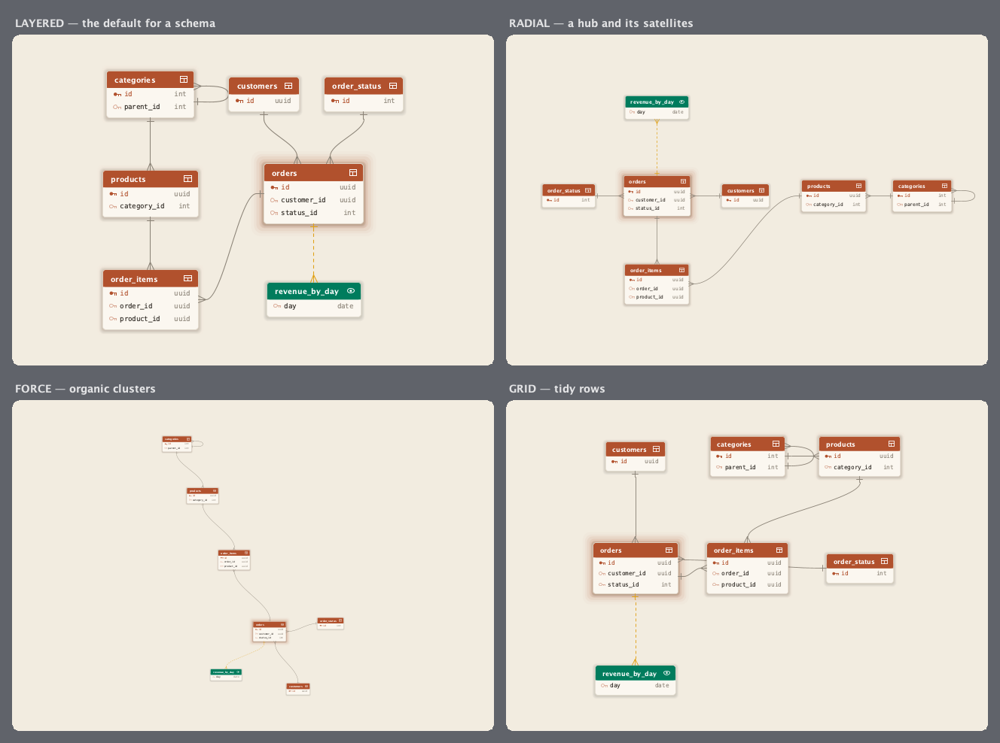

# Layouts

Mappa places boxes for you. You choose the *mode* — the product-level question of how a map should read —
and the engine handles the geometry. Set it with `.layout(...)`, or leave it on `AUTO`.



## The modes

| Mode | Reads as | Good for |
|---|---|---|
| `LAYERED` | References flow in one direction; a dependency sits below what it points at. | Schemas — the default once a map has structure. |
| `RADIAL` | The most-connected entity anchors the centre, the rest orbit it. | A hub-and-spoke model — one core table, many satellites. |
| `FORCE` | Boxes repel, edges pull; the graph relaxes into organic clusters. | Dense, many-to-many graphs with no obvious spine. |
| `GRID` | Tidy rows and columns, no edges consulted. | Catalogues where structure doesn't matter, or a first glance. |

## What `AUTO` picks

`AUTO` (the default) chooses from the map's shape, so a first render is never wrong-footed:

- **Two entities or fewer** → `GRID`. There's nothing to layer.
- **More than two** → `LAYERED`. Most maps are schemas, and layers show their direction.

`MappaDetail.AUTO` pairs with it: a map of **more than ten** entities drops to `KEYS` (primary keys and
references only) so a large schema stays legible; anything smaller shows `ALL_FIELDS`.

```java
Mappa.view(map).component();                       // AUTO layout + AUTO detail
Mappa.view(map).layout(MappaLayout.FORCE).component();
Mappa.view(map).detail(MappaDetail.ALL_FIELDS).component();
```

## Edges

Layout decides *where* boxes go; `MappaEdges` decides how the references between them are drawn:

| Style | Line |
|---|---|
| `CURVED` | A gentle quadratic bend — the default (what `AUTO` resolves to). |
| `ORTHOGONAL` | Right-angled routing, the classic ERD look. |
| `STRAIGHT` | A direct segment, centre to centre. |
| `DIRECTIONAL` | Curved, plus a from→to colour gradient (outbound to inbound) so direction is unmissable. |

Every edge terminates in crow's-foot notation at the parent and a tick at the child. A reference you
marked **suggested** draws dashed; a **self-reference** (a field pointing back at its own table, like
`categories.parent_id → categories.id`) loops off the box's edge rather than collapsing to a point.

Turn on `relationshipLabels(true)` to print the joined columns (`customer_id -> id`) at each edge's
midpoint.

## Large schemas

A big schema is not laid out as one flat graph. Mappa splits it into connected components, and detects
communities (densely-linked neighbourhoods) within large ones, then lays out each community independently
and packs them — with cross-community edges drawn between the packed regions. The result reads as tidy,
separated neighbourhoods rather than a hairball, whichever mode you pick (the mode arranges *within* each
community). Every layout is deterministic: the same schema always lays out the same way.

On screen, the canvas stays fast on hundreds of tables by level-of-detail and viewport culling: past a
table-count threshold, zoomed-out boxes simplify (drop columns, then names, then the relationship web) and
only what's actually visible is drawn. A full export bypasses LOD, so the exported image always carries
complete detail.

## Moving boxes by hand

Auto-placement is a starting point, not a cage. In the live component, drag any box and its edges follow;
double-click the canvas to fit everything back into view. Exports always fit the whole map to the frame.
