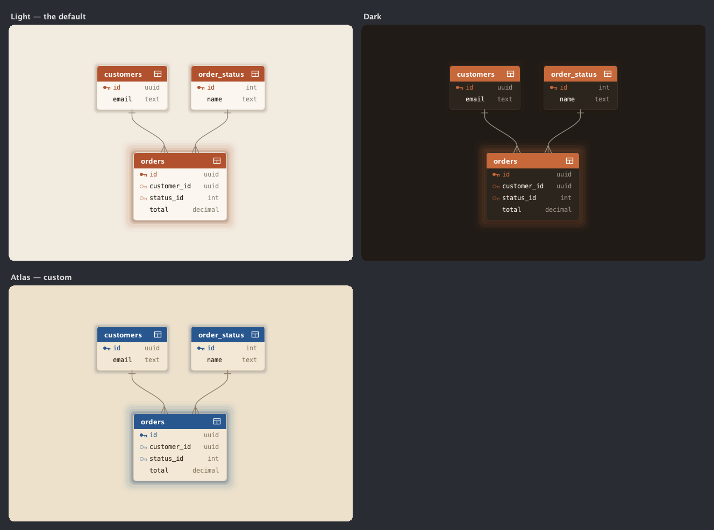

# Theming

Every colour Mappa draws with lives in one immutable `MappaTheme`. Pass it per view with `.theme(...)`,
and the whole visual identity follows — page, boxes, headers, edges, and labels.



## Start from a base

Two starting points ship in the box, both a warm, print-like palette of paper and dried ink. `of(boolean)`
picks between them:

```java
MappaTheme.light();     // warm paper, terracotta headers, deep-teal marks — the default
MappaTheme.dark();      // an inkwell lit by ember, with verdigris and brass
MappaTheme.of(isDark);
```

Neither is a registry entry or an XML file — a theme is a value, and every field has a sensible default
for its light/dark mode, so you only override what you care about.

## The slots

Each fluent setter returns a *new* theme (the original is never touched), so overrides chain:

| Slot | Paints |
|---|---|
| `background` | The page behind the map. |
| `surface` | The fill of every entity box (and the label/status chips). |
| `text` / `muted` | Field names / their types and secondary text. |
| `line` | Hairline borders and row separators. |
| `accent` | Primary-key dots and the soft halo behind a central box. |
| `entityHeader` | The title bar of a `TABLE`/`ENTITY` box. |
| `viewHeader` | The title bar of a `VIEW` box — set apart from tables on purpose. |
| `reference` | Declared reference edges and their crow's feet; reference-field dots. |
| `suggestedReference` | Inferred (dashed) reference edges. |
| `inbound` / `outbound` | The two ends of a `DIRECTIONAL` edge's gradient. |
| `clusterRegion` | Reserved for cluster shading. |

## Your own theme

A custom identity is one expression — override the handful of slots that carry it:

```java
MappaTheme atlas = MappaTheme.light()          // an old atlas: aged paper, cartographer's inks
        .background(new Color(0xEDE1CC))
        .surface(new Color(0xF2E8D5))
        .text(new Color(0x3B2F22))
        .accent(new Color(0xBF6F33))           // sienna keys
        .entityHeader(new Color(0x28568E))     // map-navy headers
        .viewHeader(new Color(0x007F68))       // teal views
        .suggestedReference(new Color(0xBD9A32));  // gold inferred edges

Mappa.view(map).theme(atlas).component();
```

The `isDark()` flag isn't cosmetic: it nudges the drop-shadow weight and the backdrop pattern's contrast,
so a dark surface still reads as elevated. Keep it truthful to your `background` and the depth cues stay
right. `ThemeGallery` (under `samples/`) switches a few of these live if you want to feel them out.
